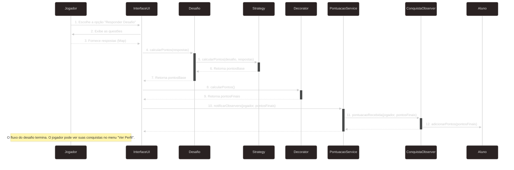

# IFBADevQuest - Plataforma Colaborativa de Aprendizagem Gamificada

## Visão Geral

**IFBADevQuest** é um protótipo de uma plataforma de aprendizagem gamificada desenvolvida como projeto final para a disciplina de **Padrões de Projeto**. O sistema foi construído em Java e demonstra a aplicação prática de 9 padrões de projeto do "Gang of Four" (GoF) e dos princípios de design SOLID para criar uma arquitetura robusta, modular e extensível.

A aplicação simula um ambiente educacional onde um aluno pode responder a desafios (quizzes), acumular pontos, receber bônus, desbloquear conquistas (medalhas) e gerar relatórios de seu desempenho em diferentes formatos.

## Contexto Acadêmico

* **Instituição:** Instituto Federal de Educação, Ciência e Tecnologia da Bahia (IFBA) - Campus Santo Antônio de Jesus
* **Curso:** Superior de Tecnologia em Análise e Desenvolvimento de Sistemas
* **Disciplina:** Padrões de Projeto
* **Docente:** Felipe Silva

## Tecnologias Utilizadas

* **Linguagem:** Java
* **Gerenciador de Dependências:** Apache Maven
* **Bibliotecas Externas:**
    * **Google Gson:** Para geração de relatórios em formato JSON.
    * **iText7 Core:** Para geração de relatórios em formato PDF.

## Funcionalidades Implementadas

* **Gerenciamento de Usuários:** Criação de perfis de `Aluno`, `Professor` e `Visitante` através de uma fábrica.
* **Sistema de Desafios:** Arquitetura flexível baseada em composição para a criação de desafios, com um quiz de matemática como exemplo.
* **Sistema de Pontuação:** Cálculo de pontos baseado em estratégias configuráveis (ex: pontuação por acerto).
* **Gamificação:**
    * Sistema de conquistas com medalhas e conjuntos de medalhas.
    * Aplicação de bônus dinâmicos (ex: XP em dobro) sobre a pontuação.
* **Notificações:** Desbloqueio automático de medalhas quando um aluno atinge uma pontuação específica, utilizando o padrão Observer.
* **Relatórios:** Geração de relatórios de desempenho do aluno nos formatos **CSV, JSON e PDF**, salvos em um diretório `relatorios/`.
* **Interface de Console:** Uma UI simples via console para demonstrar o fluxo completo da aplicação.

## Diagramas
### 🔹 Diagrama de Classes

```mermaid
---
config:
  look: neo
  theme: redux
---
classDiagram
    title IFBADevQuest - Diagrama de Classes Detalhado
    subgraph user
        class UsuarioFactory:::Vermelho {
            <<Factory>>
            +criarUsuario(tipo, nome)* Usuario
        }
        class Usuario:::Vermelho {
            <<Interface>>
            +getNome() String
            +getTipo() String
        }
        class Aluno:::Vermelho {
            -nome: String
            -pontosTotais: int
            -muralDeConquistas: ConjuntoDeMedalhas
            +adicionarPontos(pontos) void
            +getMuralDeConquistas() ConjuntoDeMedalhas
        }
        class Professor:::Vermelho {
            -nome: String
        }
        class Visitante:::Vermelho {
             -nome: String
        }
        class SessaoManager:::Vermelho {
            <<Singleton>>
            -instancia: SessaoManager
            +getInstancia()* SessaoManager
        }
        Usuario <|.. Aluno
        Usuario <|.. Professor
        Usuario <|.. Visitante
        UsuarioFactory ..> Usuario : cria
    end
    subgraph challenge
        class Desafio:::Cinza {
            -titulo: String
            -componentes: List~ComponenteDesafio~
            -pontuacaoStrategy: PontuacaoStrategy
            +adicionarComponente(c) void
            +setPontuacaoStrategy(ps) void
            +calcularPontos(resposta) int
        }
        class ComponenteDesafio:::Cinza {
            <<Interface>>
            +getTipo() String
        }
        class ComponenteQuiz:::Cinza {
            -questoes: List~Questao~
            +adicionarQuestao(q) void
        }
        Desafio *-- ComponenteDesafio
        subgraph strategy
            class PontuacaoStrategy:::Cinza {
                <<Interface>>
                +calcularPontos(desafio, resposta) int
            }
            class AcertoSimplesStrategy:::Cinza
            PontuacaoStrategy <|.. AcertoSimplesStrategy
            Desafio --> PontuacaoStrategy
        end
    end
    subgraph gamification
        subgraph conquest
            class ConquistaComponent:::Rosa {
                <<Interface>>
                +getNome() String
                +exibir() void
            }
            class Medalha:::Rosa {
                -nome: String
            }
            class ConjuntoDeMedalhas:::Rosa {
                -nome: String
                -conquistas: List~ConquistaComponent~
                +adicionar(c) void
            }
            ConquistaComponent <|.. Medalha
            ConquistaComponent <|.. ConjuntoDeMedalhas
            ConjuntoDeMedalhas o-- ConquistaComponent
            Aluno --> ConjuntoDeMedalhas
        end
        subgraph bonus
            class CalculadorDePontos:::Rosa {
                <<Interface>>
                +calcularPontos() int
            }
            class CalculadorDePontosBase:::Rosa {
                -pontosBase: int
            }
            class PontosDecorator:::Rosa {
                <<Abstract>>
                #calculadorBase: CalculadorDePontos
            }
            class DoubleXPDecorator:::Rosa
            CalculadorDePontos <|.. CalculadorDePontosBase
            CalculadorDePontos <|.. PontosDecorator
            PontosDecorator <|-- DoubleXPDecorator
            PontosDecorator o-- CalculadorDePontos
        end
    end
    subgraph notification
        class PontuacaoService:::Roxo {
            <<Subject>>
            -observers: List~PontuacaoObserver~
            +adicionarObserver(o) void
            +notificarObservers(usuario, pontos) void
        }
        class PontuacaoObserver:::Roxo {
            <<Interface>>
            +pontuacaoRecebida(usuario, pontos) void
        }
        class ConquistaObserver:::Roxo
        PontuacaoObserver <|.. ConquistaObserver
        PontuacaoService o-- PontuacaoObserver
    end
    subgraph history
        class HistoricoDeAcao:::Verde {
            -historico: Stack~Comando~
            +executarComando(c) void
            +desfazerUltimoComando() void
        }
        class Comando:::Verde {
            <<Interface>>
            +executar() void
            +desfazer() void
        }
        class AdicionarPontosComando:::Verde {
            -aluno: Aluno
            -pontos: int
        }
        Comando <|.. AdicionarPontosComando
        HistoricoDeAcao o-- Comando
        AdicionarPontosComando ..> Aluno
    end
    subgraph reporting
        class Relatorio:::Amarelo {
            <<Facade>>
            +gerarRelatorioDesempenho(usuario, formato) void
        }
        class GeradorCSV:::Amarelo
        class GeradorJSON:::Amarelo
        class GeradorPDF:::Amarelo
        Relatorio ..> GeradorCSV
        Relatorio ..> GeradorJSON
        Relatorio ..> GeradorPDF
        class ServicoDeRanking:::Amarelo {
            <<Interface>>
            +atualizarPontuacao(usuario, pontos) void
        }
        class APIExternaRanking:::Amarelo {
            +enviarScore(id, pontos) void
        }
        class RankingAdapter:::Amarelo {
            <<Adapter>>
            -apiExterna: APIExternaRanking
        }
        ServicoDeRanking <|.. RankingAdapter
        RankingAdapter ..> APIExternaRanking
    end
    subgraph ui
        class InterfaceUI:::Aqua {
            -scanner: Scanner
            -jogador: Aluno
            +run() void
        }
        InterfaceUI --> PontuacaoService
        InterfaceUI --> Relatorio
        InterfaceUI --> UsuarioFactory
    end

    classDef Aqua :, fill:#DEFFF8, color:#000000, stroke:#333,stroke-width:2px
    classDef Amarelo :, fill:#E3C66D, color:#000000, stroke:#333,stroke-width:2px
    classDef Verde :, fill:#A2F296, color:#000000, stroke:#333,stroke-width:2px
    classDef Roxo :, fill:#969CF2, color:#000000, stroke:#333,stroke-width:2px
    classDef Rosa :, fill:#D9BFF7, color:#000000, stroke:#333,stroke-width:2px
    classDef Cinza :, fill:#C7C3BD, color:#000000, stroke:#333,stroke-width:2px
    classDef Vermelho :, fill:#FA9898, color:#000000, stroke:#333,stroke-width:2px
```

### 🔹 Diagrama de Sequência


## Padrões de Projeto Aplicados

O núcleo do projeto foi a aplicação de 9 padrões de projeto para solucionar problemas específicos de design:

### Padrões de Criação

1.  **Singleton:** Aplicado na classe `SessaoManager` para garantir uma única instância de controle de sessão de usuário.
2.  **Factory Method:** Utilizado na `UsuarioFactory` para criar diferentes tipos de usuários (`Aluno`, `Professor`) sem expor a lógica de instanciação ao cliente.

### Padrões Estruturais

3.  **Composite:** Usado no sistema de conquistas (`ConquistaComponent`, `Medalha`, `ConjuntoDeMedalhas`) para tratar tanto conquistas individuais quanto grupos de conquistas de maneira uniforme.
4.  **Decorator:** Aplicado no cálculo de bônus (`CalculadorDePontos`, `DoubleXPDecorator`) para adicionar funcionalidades (bônus) a objetos dinamicamente.
5.  **Facade:** Utilizado na classe `Relatorio` para prover uma interface simplificada para o subsistema complexo de geração de relatórios em múltiplos formatos.
6.  **Adapter:** (Simulado) O design do `RankingAdapter` foi planejado para adaptar uma API externa com interface incompatível ao sistema de ranking interno.

### Padrões Comportamentais

7.  **Strategy:** Empregado no sistema de desafios (`PontuacaoStrategy`, `AcertoSimplesStrategy`) para permitir que o algoritmo de cálculo de pontos seja selecionado e trocado em tempo de execução.
8.  **Observer:** Utilizado para notificar o sistema sobre novas pontuações (`PontuacaoService`, `ConquistaObserver`), permitindo que a lógica de verificação de conquistas reaja a esses eventos de forma desacoplada.
9.  **Command:** Aplicado no sistema de histórico de ações (`Comando`, `AdicionarPontosComando`) para encapsular ações em objetos, permitindo a implementação de funcionalidades como "desfazer".

## Como Compilar e Executar

Este projeto utiliza o Maven para gerenciamento de dependências e build.

### Pré-requisitos

* Java Development Kit (JDK) 17 ou superior.
* Apache Maven.

### Passos

1.  **Clone o repositório:**
    ```bash
    git clone [URL_DO_SEU_REPOSITORIO]
    cd ifbadevquest
    ```

2.  **Compile o projeto e baixe as dependências com o Maven:**
    ```bash
    mvn clean install
    ```
    Este comando irá compilar o código e criar um arquivo `.jar` executável na pasta `target/`.

3.  **Execute a aplicação:**
    ```bash
    java -jar target/ifbadevquest-1.0-SNAPSHOT.jar
    ```
    A interface de console do **IFBADevQuest** será iniciada.
